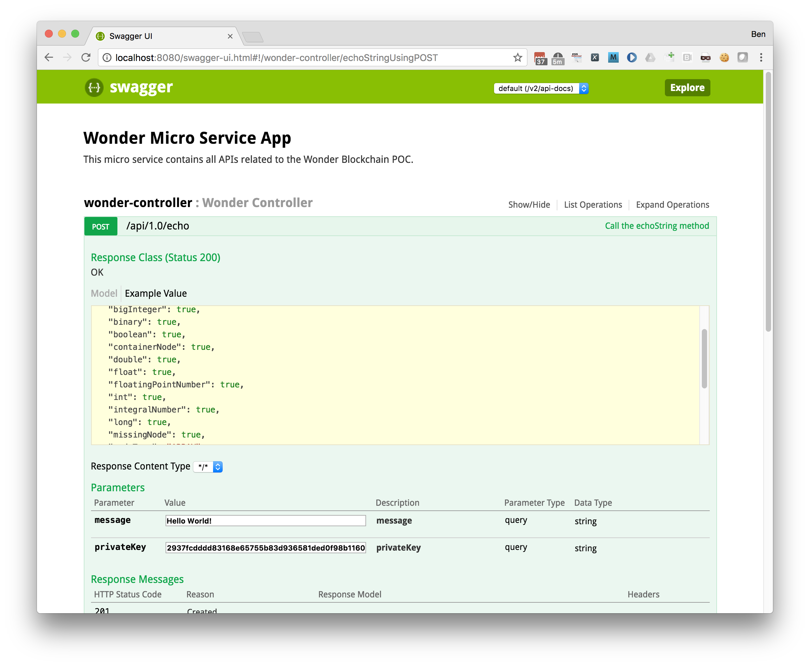

# Spring Boot App

This project contains a very basic Spring Boot app providing an API for the Echo contract.

## How to configure it?

First, you need to have `testrpc` running, that we'll show you something like that:

```
EthereumJS TestRPC v4.0.1 (ganache-core: 1.0.1)

Available Accounts
==================
(0) 0x723d476ef50d875f6ab1efe0f061b1b4545019d6
...

Private Keys
==================
(0) 2937fcdddd83168e65755b83d936581ded0f98b116017e251aa52fe236db2a43
...

HD Wallet
==================
Mnemonic:      screen reduce quiz click merry soft define wagon total boss wear sight
Base HD Path:  m/44'/60'/0'/0/{account_index}

Listening on localhost:8545
```

Remember the private key, it will be used to identify you in the call.

Next, you need to be sure that you deployed the Hello contracts. When you did it (using Truffle), you probably saw:

```
Using network 'development'.

Running migration: 1_initial_migration.js
  Deploying Migrations...
  ... 0xa1546d7ebae7e709472285dc8af806131d996fd48d9de4851e54fa389b128c6f
  Migrations: 0xe710680398a56d1f32d930039339978a4ddd9c99
Saving successful migration to network...
  ... 0x9751632fda9a2d86e5791139ab86f364983c849ab6ce7a66e4c58bc73218435e
Saving artifacts...
Running migration: 2_deploy_contracts.js
  Deploying Echo...
  ... 0x7b804204ded462c2fade1d3e695f1e885b7b07e549e438e60bd161677424a10d
  Echo: 0xb1d562b861d955de2fac347d440977119e425fad
Saving successful migration to network...
  ... 0x51d9a27946455e28ce6aeb1ca9bfb1d74fcc15fa74eed074e88ae59e0ecc4c75
Saving artifacts...
```

Be sure to remember the contract address. In the case above, it's the value `0xb1d562b861d955de2fac347d440977119e425fad`. This value has to be saved in the file `src/main/resources/application.properties`:

```
blockchain.contracts.echo.address=0xb1d562b861d955de2fac347d440977119e425fad
```

## How to run it?

When you are in the project, execute the following command:

```
mvn clean spring-boot:run
```

It will start the Spring Boot app.

## How to use it?

Just open your browser on the following URL:

```
http://localhost:8080/swagger-ui.html
```

And you can use the echo API with the private key (that you got when `testrpc` started) and the message that you wants to send. It will output a message like that:


```
{
  "blockHash": "0xf0742d844f3afe2c9c322bdfba6d7671bd57762e11a5dfc61611ab5699cc2952",
  "blockNumber": "5",
  "idx": "0x00",
  "hash": "0x839ada0f6ca177b1e57da6cfb830fad4d6a5a4f286052bdbdce323301219234f"
}
```




## Want to know how the Java wrapper has been generated...

First, I installed `web3j`:

```
brew tap web3j/web3j
brew install web3j
```

Then, I generated the contracts in a format required by `web3j`:

```
solcjs echo.sol --bin --abi --optimize -o <SPRING BOOT APP HOME>/src/main/resources/
```

And, I generated the Java wrapper:

```
web3j solidity generate \
	<SPRING BOOT APP HOME>/src/main/resources/echo_sol_Echo.bin \
	<SPRING BOOT APP HOME>/src/main/resources/echo_sol_Echo.abi \
	-o  <SPRING BOOT APP HOME>/src/main/java/ \
	-p gov.cdc.wonder.contracts.hello
```